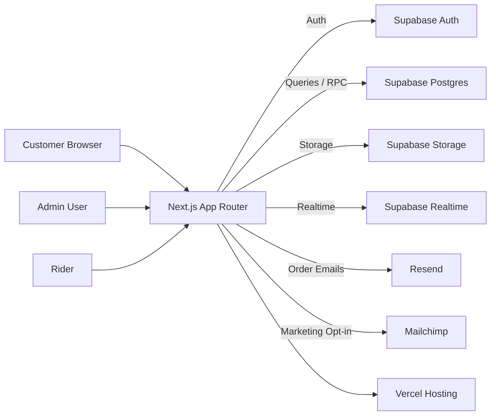
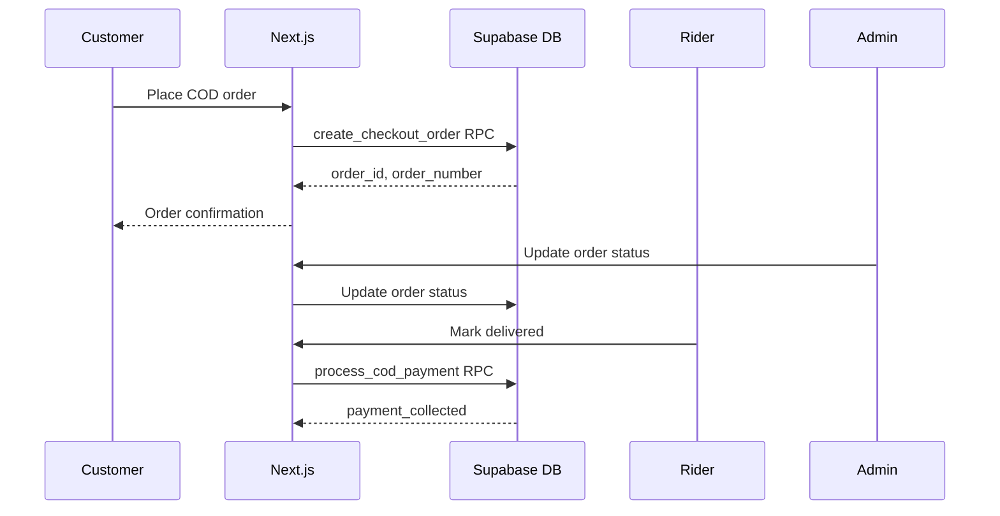

# Architecture Diagram

## System Overview

```mermaid
flowchart LR
  Customer[Customer Browser] --> NextApp[Next.js App Router]
  Admin[Admin User] --> NextApp
  Rider[Rider] --> NextApp

  NextApp -->|Auth| SupaAuth[Supabase Auth]
  NextApp -->|Queries / RPC| SupaDB[Supabase Postgres]
  NextApp -->|Storage| SupaStorage[Supabase Storage]
  NextApp -->|Realtime| SupaRealtime[Supabase Realtime]

  NextApp -->|Order Emails| Resend[Resend]
  NextApp -->|Marketing Opt-in| Mailchimp[Mailchimp]

  NextApp --> Vercel[Vercel Hosting]
```

## COD Order Flow

```mermaid
sequenceDiagram
  participant Customer
  participant Web as Next.js
  participant DB as Supabase DB
  participant Rider
  participant Admin

  Customer->>Web: Place COD order
  Web->>DB: create_checkout_order RPC
  DB-->>Web: order_id, order_number
  Web-->>Customer: Order confirmation
  Admin->>Web: Update order status
  Web->>DB: Update order status
  Rider->>Web: Mark delivered
  Web->>DB: process_cod_payment RPC
  DB-->>Web: payment_collected
```
